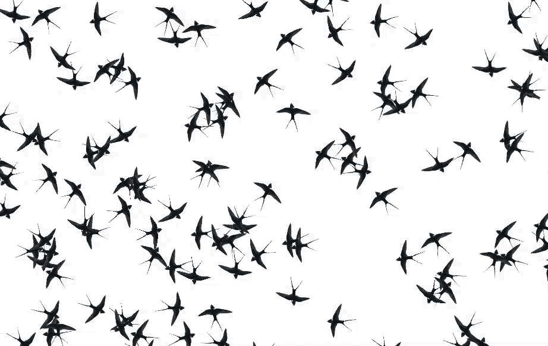

# flocker

Author: Sidharth Mishra

This is a prototype for flocking simulation app using p5.js.

Following is an erratic demo (parameters are a mess) for Swallows flocking in the Flocker app.

For the following simulation the parameters are set at:

* DESIRED_SEPARATION = 100.0

* DESIRED_ALIGNMENT = 50.0

* DESIRED_COHESION = 50.0

* SEPRATION_WEIGHT = 3.5

* ALIGNMENT_WEIGHT = 2.0

* COHESION_WEIGHT = 2.0

* Swallow count = 30

## References

[1] D. Shiffman, "Flocking", [Online] Website: [https://processing.org/examples/flocking.html](https://processing.org/examples/flocking.html)

[2] G. Kogan, "P5JS transformations", [Online] Website: [http://genekogan.com/code/p5js-transformations/](http://genekogan.com/code/p5js-transformations/)

[3] P5JS reference, [Online] Website: [https://p5js.org/reference](https://p5js.org/reference)
